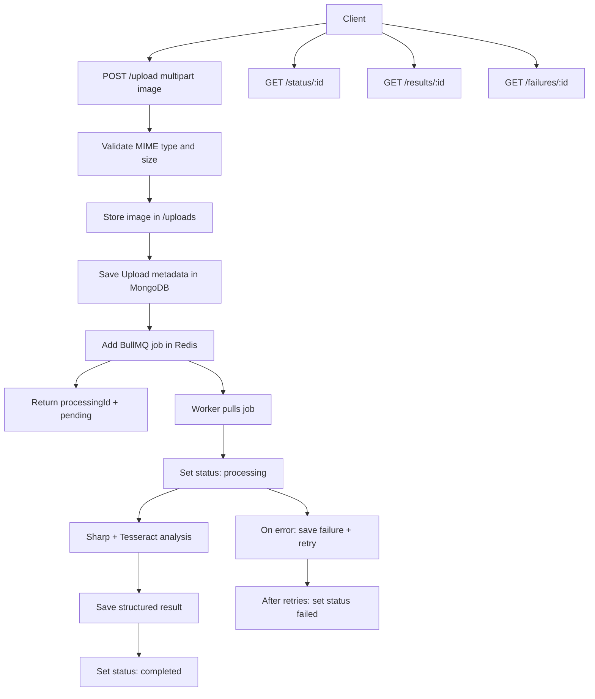

# Intelligent Media Processing Pipeline

Production-oriented backend for vehicle image uploads, asynchronous image analysis, and structured quality/fraud reports.

## Architecture Overview

The system is split into an API process and a worker process.

- API layer: Express handles upload, status, result, failure, health, and Swagger documentation endpoints.
- Storage: Multer writes accepted images to `uploads/` using a generated processing ID as the filename base.
- Database: MongoDB stores upload metadata, processing results, and failure history through Mongoose models.
- Queue: BullMQ stores processing jobs in Redis. The API enqueues jobs after metadata is committed.
- Worker: A separate worker consumes BullMQ jobs, updates status transitions, retries failed attempts, and writes analysis output.
- OCR: Tesseract extracts candidate number plate text.
- Image analysis: Sharp-based grayscale processing implements blur, brightness, duplicate, screenshot, and tampering heuristics.

## Service Flow Diagram



## Features

- `POST /upload` for JPEG, PNG, and WEBP uploads.
- Local file persistence in `uploads/`.
- MongoDB metadata with `processingId`, filename, timestamp, status, file hash, and perceptual hash.
- BullMQ background processing with retry and exponential backoff.
- Status lifecycle: `pending`, `processing`, `completed`, `failed`.
- Blur detection using variance of Laplacian.
- Brightness check using average grayscale intensity.
- Duplicate detection using MD5 and average-hash perceptual matching.
- OCR extraction with Tesseract.
- Indian vehicle number validation, including common state and BH series formats.
- Screenshot/photo-of-photo heuristic using resolution, aspect ratio, border contrast, and EXIF presence.
- Tampering suspicion heuristic using local noise inconsistency, sharpness, and metadata clues.
- Structured logging with Pino.
- Rate limiting, Helmet, compression, CORS, Swagger docs, config validation, Docker Compose, tests.

## Setup With Docker

1. Create an env file:

```bash
cp .env.example .env
```

2. Start all services:

```bash
docker compose up --build
```

3. Open:

- API: `http://localhost:3000`
- Swagger docs: `http://localhost:3000/docs`
- Health: `http://localhost:3000/health`

Docker Compose starts MongoDB, Redis, the API, and the worker. Uploaded files are stored in a named Docker volume.

## Local Setup

Requirements:

- Node.js 20+
- MongoDB
- Redis
- Tesseract runtime installed locally if using native OCR outside Docker

Install dependencies:

```bash
npm install
```

Create `.env`:

```bash
cp .env.example .env
```

For local services, set:

```env
MONGODB_URI=mongodb://127.0.0.1:27017/media_pipeline
REDIS_HOST=127.0.0.1
REDIS_PORT=6379
```

Run API and worker in separate terminals:

```bash
npm run dev
npm run dev:worker
```

Build and run production output:

```bash
npm run build
npm start
npm run start:worker
```

## Environment Variables

| Variable | Purpose | Default |
| --- | --- | --- |
| `NODE_ENV` | Runtime mode | `development` |
| `PORT` | API port | `3000` |
| `MONGODB_URI` | Mongo connection URI | Required outside test |
| `REDIS_HOST` | Redis host | `127.0.0.1` |
| `REDIS_PORT` | Redis port | `6379` |
| `REDIS_PASSWORD` | Optional Redis password | Empty |
| `UPLOAD_DIR` | Local upload folder | `uploads` |
| `MAX_UPLOAD_MB` | Upload limit | `10` |
| `LOG_LEVEL` | Pino log level | `info` |
| `QUEUE_NAME` | BullMQ queue name | `media-processing` |
| `WORKER_CONCURRENCY` | Jobs per worker process | `2` |
| `RATE_LIMIT_WINDOW_MS` | Rate limit window | `60000` |
| `RATE_LIMIT_MAX` | Requests per window | `60` |

The code also supports `MONGO_URI` and the previously supplied `MOGO_URI` as fallbacks, but `MONGODB_URI` is the recommended name.

## API Documentation

### Upload Image

```bash
curl -X POST http://localhost:3000/upload \
  -F "image=@/path/to/vehicle.jpg"
```

Response:

```json
{
  "processingId": "3e2d5c2e-a03f-41cc-a197-69ef86fd93be",
  "status": "pending"
}
```

### Get Status

```bash
curl http://localhost:3000/status/3e2d5c2e-a03f-41cc-a197-69ef86fd93be
```

Response:

```json
{
  "processingId": "3e2d5c2e-a03f-41cc-a197-69ef86fd93be",
  "status": "completed",
  "filename": "vehicle.jpg",
  "uploadTimestamp": "2026-05-17T15:00:00.000Z",
  "startedAt": "2026-05-17T15:00:01.000Z",
  "completedAt": "2026-05-17T15:00:06.000Z",
  "attempts": 1
}
```

### Get Results

```bash
curl http://localhost:3000/results/3e2d5c2e-a03f-41cc-a197-69ef86fd93be
```

Response shape:

```json
{
  "processingId": "3e2d5c2e-a03f-41cc-a197-69ef86fd93be",
  "imageMetadata": {
    "width": 1280,
    "height": 720,
    "format": "jpeg",
    "hasExif": true,
    "sizeBytes": 482001
  },
  "checks": {
    "blur": { "value": 134.2, "passed": true, "confidence": 0.95 },
    "brightness": { "value": 118.4, "passed": true, "confidence": 0.9 },
    "duplicate": { "value": false, "passed": true, "confidence": 0.7 },
    "ocr": {
      "value": "MH12AB1234",
      "passed": true,
      "confidence": 0.82,
      "extractedText": "MH 12 AB 1234",
      "candidates": ["MH12AB1234"],
      "validPlate": "MH12AB1234"
    },
    "indianPlateValidation": { "value": "MH12AB1234", "passed": true, "confidence": 0.95 },
    "screenshotHeuristic": { "value": 12.1, "passed": true, "confidence": 0.62 },
    "tamperingSuspicion": { "value": 2.4, "passed": true, "confidence": 0.58 }
  },
  "summary": {
    "qualityScore": 1,
    "fraudRiskScore": 0,
    "flags": []
  }
}
```

If processing is not finished, `GET /results/:id` returns `202`.

### Get Failures

```bash
curl http://localhost:3000/failures/3e2d5c2e-a03f-41cc-a197-69ef86fd93be
```

Response:

```json
{
  "processingId": "3e2d5c2e-a03f-41cc-a197-69ef86fd93be",
  "status": "failed",
  "failures": [
    {
      "reason": "Input file is missing",
      "attempt": 3,
      "failedAt": "2026-05-17T15:00:06.000Z"
    }
  ]
}
```

## Database Schema

### Upload

Stores the operational state of a submitted image:

- `processingId`
- `originalFilename`
- `storedFilename`
- `path`
- `mimeType`
- `sizeBytes`
- `fileHash`
- `perceptualHash`
- `status`
- timestamps and attempt count

### ProcessingResult

Stores the immutable analysis report for one processing ID:

- image metadata
- blur, brightness, duplicate, OCR, plate validation, screenshot, and tampering checks
- confidence scores
- summary scores and flags
- analyzer version and duration

### Failure

Stores every failed attempt:

- processing ID
- reason
- stack trace internally
- attempt number
- timestamp

## Failure Handling Strategy

- Upload metadata is saved before queueing so every accepted upload has a traceable record.
- Jobs retry 3 times with exponential backoff.
- Each failed attempt creates a `Failure` document.
- The upload is marked `failed` only after the final attempt is exhausted.
- Worker shutdown uses `worker.close()` so active jobs are not abandoned mid-handler.
- API and worker use shared structured logging with processing IDs for debugging.

## Testing Strategy

Implemented tests:

- Unit tests for Indian plate normalization, extraction, and validation.
- API tests for upload, metadata persistence, status lookup, and file-type rejection.
- MongoDB is tested with `mongodb-memory-server`.
- BullMQ is mocked in API tests so Redis is not required for unit/integration test execution.

Run:

```bash
npm test
npm run build
```

Recommended future test expansion:

- Worker integration test with ephemeral Redis.
- Golden-image tests for blur and brightness thresholds.
- OCR fixtures for common Indian plate layouts.
- Load test for queue throughput and upload limits.

## Engineering Trade-offs

- OpenCV equivalent: This implementation uses Sharp and custom grayscale math instead of native OpenCV. It is easier to install and Dockerize while still supporting variance of Laplacian, brightness, hashing, and basic edge/noise heuristics.
- OCR accuracy: Tesseract is practical for local execution but not plate-specialized. A production ALPR model would improve recall.
- Fraud detection: The tampering and screenshot checks are heuristic. They produce explainable suspicion scores, not legal-grade forensic conclusions.
- Local storage: Files are stored under `uploads/`. Production should use object storage such as S3/GCS with lifecycle policies.
- Duplicate detection: MD5 catches exact duplicates; average hash catches simple perceptual matches. A larger system should use a proper perceptual index.
- Queue scaling: BullMQ allows multiple workers, but local disk uploads require shared storage when workers run on different machines.
- Security: The API validates MIME type and size, but production should add antivirus scanning, authenticated access, stricter content sniffing, object-store signed URLs, and per-tenant rate limits.
- Result schema: Results are denormalized for simple API reads. If analysis versions evolve heavily, versioned result schemas may be needed.

## AI Usage Disclosure

AI assisted with:

- Generating the initial modular backend structure.
- Drafting TypeScript models, routes, services, worker code, tests, Docker files, and README content.
- Suggesting practical image-analysis heuristics suitable for a take-home assignment.

Human validation and corrections performed:

- Ensured architecture matches the assignment requirements.
- Corrected package reproducibility after dependency installation.
- Fixed TypeScript module configuration for TypeScript 6.
- Fixed OCR candidate extraction behavior for labeled text.
- Ran build and tests locally.

No external proprietary dataset or hidden model was used. The fraud checks are explicitly heuristic and documented as such.

## Project Structure

```text
src
  config        Environment, MongoDB, Redis, Swagger, logger
  controllers   Request handlers
  middlewares   Upload and error middleware
  models        Mongoose schemas
  queues        BullMQ queue setup
  routes        API routes
  services      Processing and image analysis logic
  utils         Hashing, errors, plate helpers
  workers       BullMQ worker entrypoint
tests           Jest tests
uploads         Local image storage
docker          Docker notes
scripts         Seed/reset helper
```

## Submission Notes

This repository is designed to be cloned and run with either Docker Compose or local MongoDB/Redis. For review, start with:

```bash
cp .env.example .env
docker compose up --build
```

Then upload an image and poll `/status/:id` followed by `/results/:id`.
# Ginger-media
